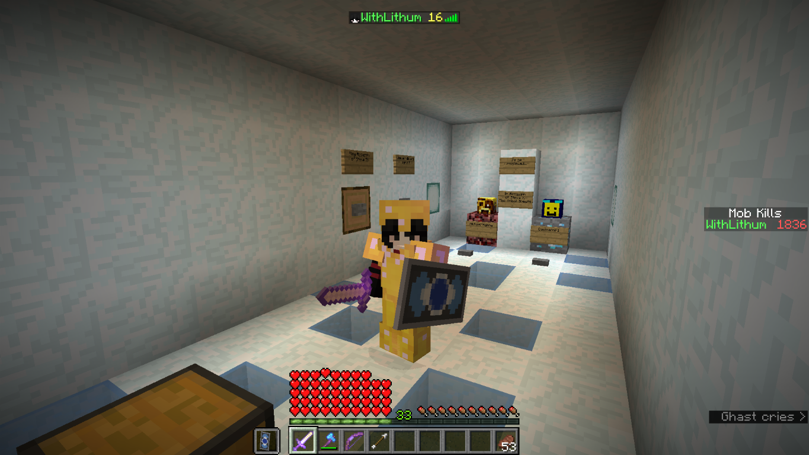
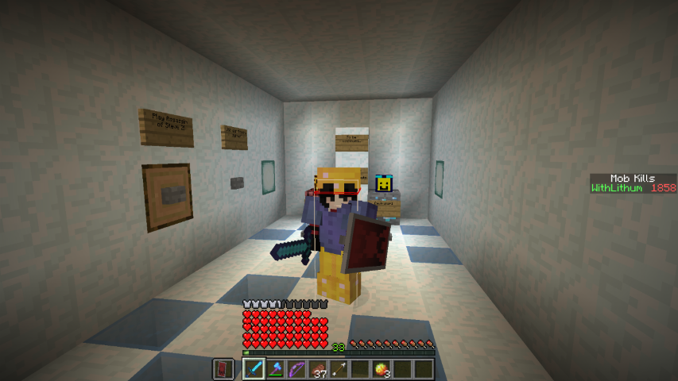
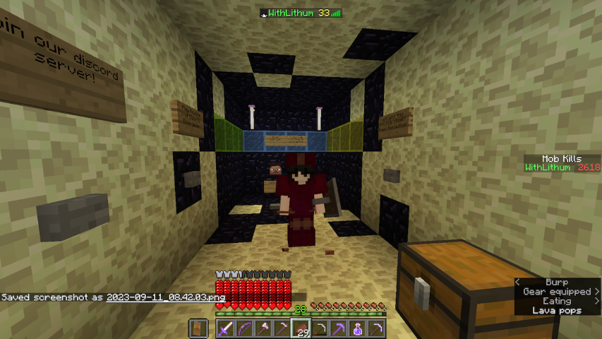
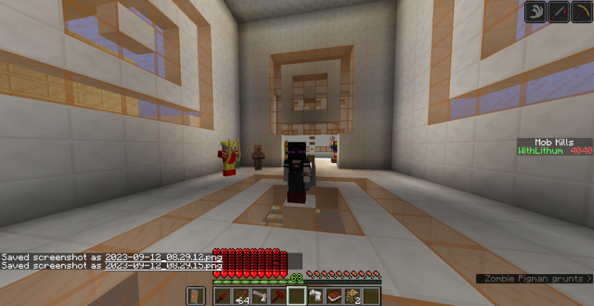

>
> **WARNING!!!**
>
> **THIS ARTICLE MAY CONTAIN SPOILERS FOR THE ASSASSIN OF STEVE SERIES.**
>

---

## Download the Maps

**YOU CAN DOWNLOAD AND PLAY THE MAPS HERE**: (listed in chronological order of canon lore)

- [Assassin of Steve](https://www.planetminecraft.com/project/assassin-of-steve-2826263/) for 1.10.2
- [Assassin of Steve 2: The Tribal Snouts](https://www.planetminecraft.com/project/adventure-map-assassin-of-steve-2-the-tribal-snouts/) for 1.10.2
- [Assassin of Steve 3: Endergeddon](https://www.planetminecraft.com/project/assassin-of-steve-3-endergeddon-1-11-2-adventure-map/) for 1.11.2

The maps are for Java Edition and MUST BE PLAYED ON EACH RESPECTIVE DESIGNATED MINECRAFT VERSION, otherwise the maps will break.

## Assassin of Steve

The map Assassin of Steve is the first in the Assassin of Steve series, and it was made for 1.7.10. In fact, the first scene in Mission 10 kinda resembles the vanilla 1.7 age for me.

### Tips I

- As it was made initially for 1.7 and updated to 1.10 at a later time, there are a lot of old mechanisms that have not been replaced with newer detection (such as the wheat section in the Starter Mission).
- This map was built on a super-flat world with no decorations, and every terrain you see is actually manually built.
- This map is probably the easiest in the series.
- Beware of soft-lock two-block-deep holes.

### More Completions

This is the proof of an older play-through.

## Assassin of Steve 2: The Tribal Snouts

This is the second map in the series and it was made initially for 1.8, and have since been updated for 1.10. A lot of later map mechanics were introduced in this map.

<!-- Screw you MarkdownLint this is a god damn different header!!!! -->

### Tips II

- **Be warned that there is an armour-stand hallway in the later parts of the map, and this will cause  very noticeable lag and FPS drop. The severity of the FPS drop and lag depends on your computer setup, but it generally makes the that part of the map lag to the point that it will be very hard to even kill just a single mob.**
- This map was built on a super-flat jungle world with jungle trees.
- The two final bosses are easy to defeat after you have engaged in direct combat with them.
- Beware of soft-lock two-block-deep holes.

## Assassin of Steve 3: Endergeddon

### Tips III

- This map is built for 1.11 and have not been updated to newer versions.
- **Do not use Minecraft Forge.** Minecraft Forge breaks several features of this map, and potentially even more:
  - The process to properly re-spawn you after completion Mission 14 does not work, and you will be stuck in The End.
  - You could be stuck in or be soft-locked after some cut-scenes.
  - All armours became unbreakable.
- **Sometimes you will encounter an issue after long-distance teleport** or **after switching to and back from Spectator Mode** that can result in:
  - Your elytra stops working.
  - Switching armours does not change your maximum health.
  - Switching weapons does not change your attack speed.
  - Your character became transparent or invisible.

  This can be fixed by dying and re-spawning, or by logging out then log back in.
- **This map utilizes cut-scenes.** You can encounter bugs like being stuck in spectator mode or the being soft-locked after cut-scene completion. There are guides in the `README.txt` file that is included with the compressed archive that the map is in.
- Beware of soft-lock two-block-deep holes.
